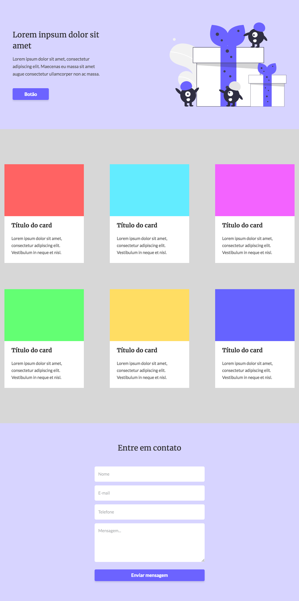

# Landing Page - Codelândia

This is a solution to the [Challenge 3 - Codelândia](<https://www.figma.com/file/dZpFBpJRNK8ATKJfSylYCr/Desafios---Codel%C3%A2ndia-(Copy)?node-id=3725%3A2>). Codelândia challenges help you improve your coding skills by building realistic design.

## Table of contents

- [Overview](#overview)
  - [The challenge](#the-challenge)
  - [Screenshot](#screenshot)
  - [Links](#links)
- [My process](#my-process)
  - [Built with](#built-with)
  - [What I learned](#what-i-learned)
  - [Useful resources](#useful-resources)
- [Author](#author)

## Overview

### The challenge

Users should be able to:

- View the optimal layout for the page depending on their device's screen size

### Screenshot



### Links

- Solution URL: [Github](https://github.com/gugavillar/onepage)
- Live Site URL: [OnePage](https://gugavillar.github.io/onepage/)

## My process

To create this landing page i used HTML5 and CSS3 and follow the figma layout. I had to download some fonts in the google fonts and download some svg images for use in the project

### Built with

- Semantic HTML5 markup
- CSS custom properties
- Flexbox
- Grid
- Mobile-first workflow

### What I learned

In this project i was learn how to use responsive grid in css and how to make a screen of responsive landing page with grid layout.

```css
div.grid-cards {
  display: grid;
  justify-content: center;
  max-width: 1242px;
  width: 100%;
  grid-template-columns: repeat(auto-fill, minmax(340px, 340px));
  grid-gap: 6.9375rem;
}
```

### Useful resources

- [A guide to grid](https://css-tricks.com/snippets/css/complete-guide-grid/) - This helped me for understand reason for use grid container in user interface. I really liked this pattern and will use it going forward.

- [A responsive grid](https://medium.com/samsung-internet-dev/common-responsive-layouts-with-css-grid-and-some-without-245a862f48df) - This helped me for understand how to make a responsive grid layout. It's really impressive how this pattern helps to created a responsive cards to use in landing page.

## Author

- Twitter - [@gugacocao](https://twitter.com/gugacocao)
- Linkedin - [gugavillar](https://www.linkedin.com/in/gugavillar/)
